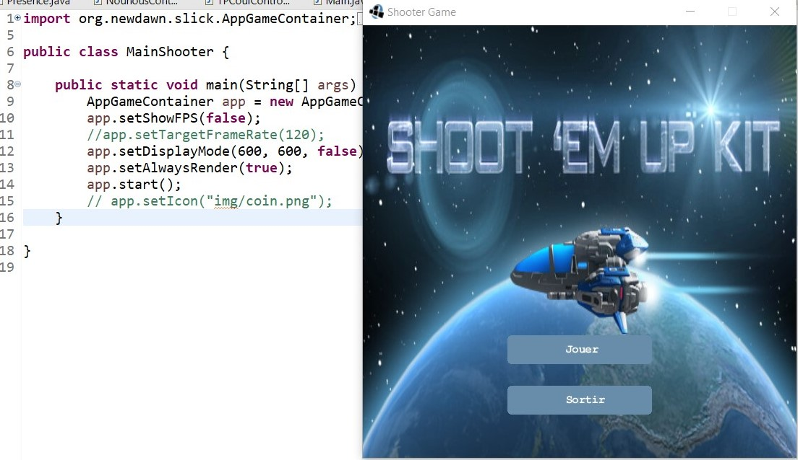
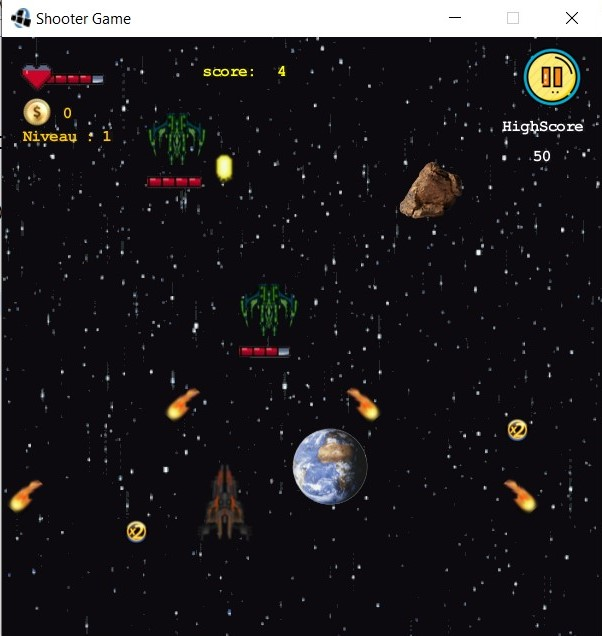
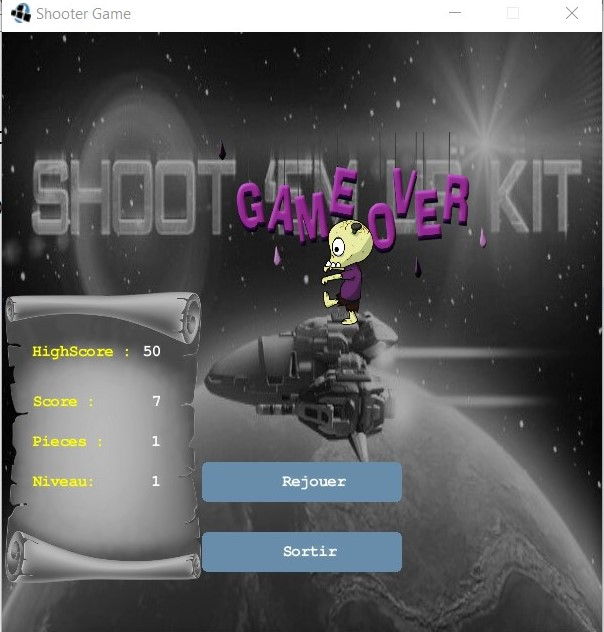
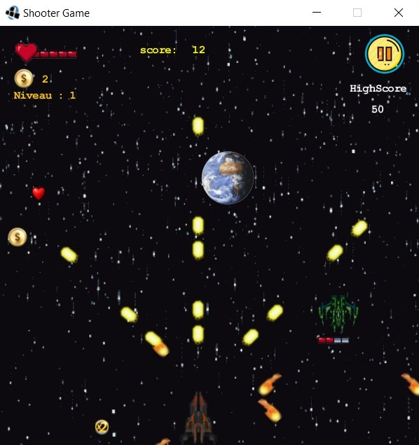
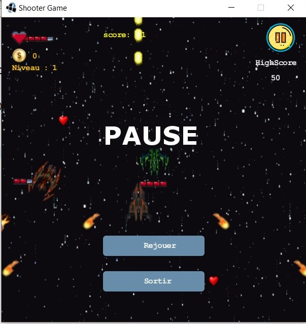
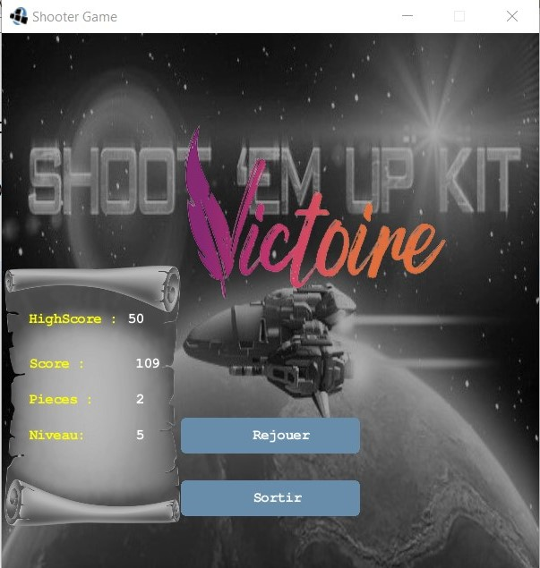

# ShooterGame
Bonjour chèere passionné d'informatique ici je te présente mon projet 100% Java et POO(Programmation Orientée Objet) 
qui consistait à la réalisation d'un shooter game 

<table>
<tr>
  <td colspan="2"></td>  
<tr>
 
<tr>
  <td></td>  
  <td></td>  
<tr>
  <tr>
  <td></td>  
  <td></td>  
<tr>
  
  <tr>
  <td></td>  
<tr>
  
</table>
